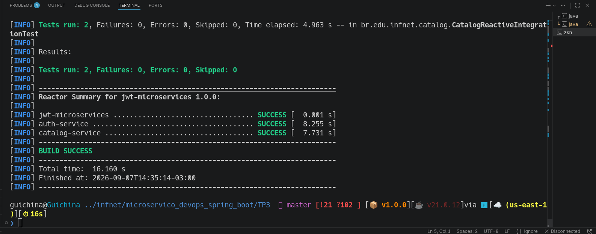
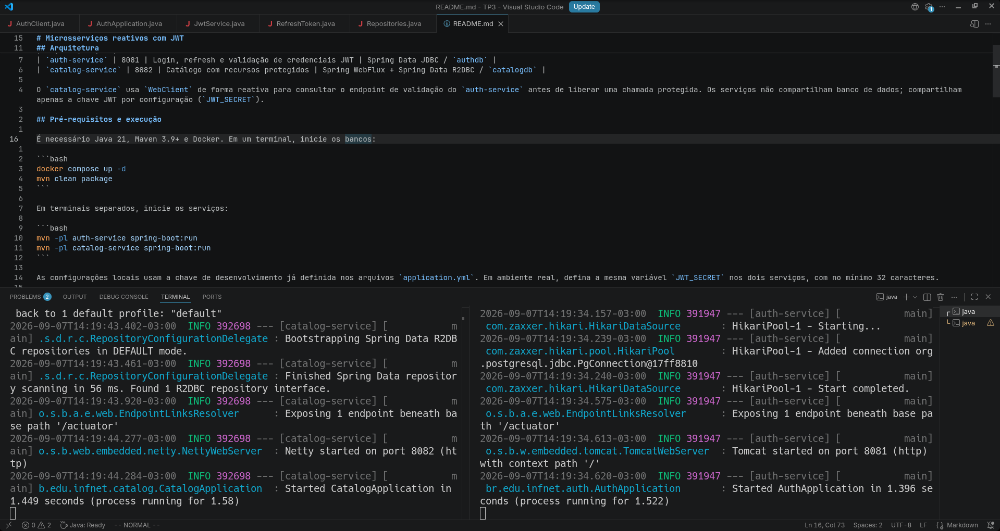
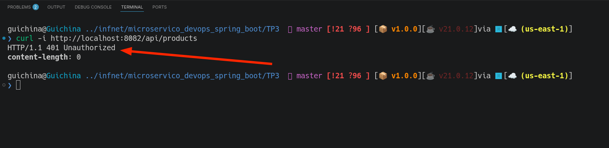
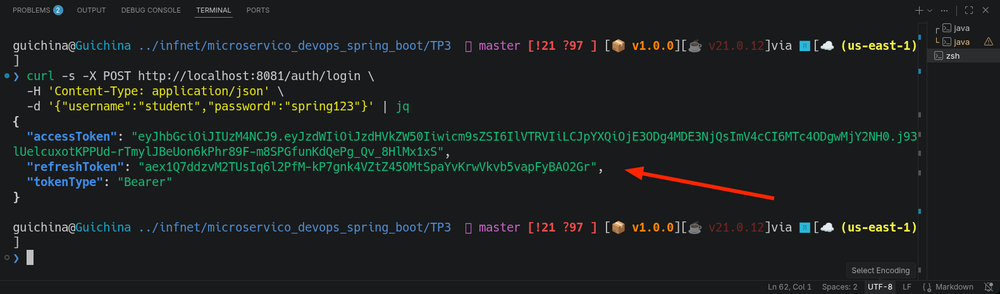
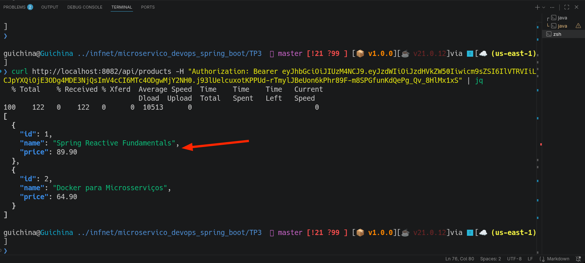
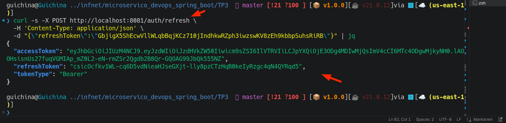
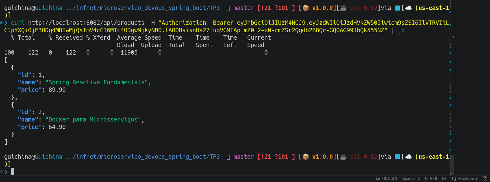
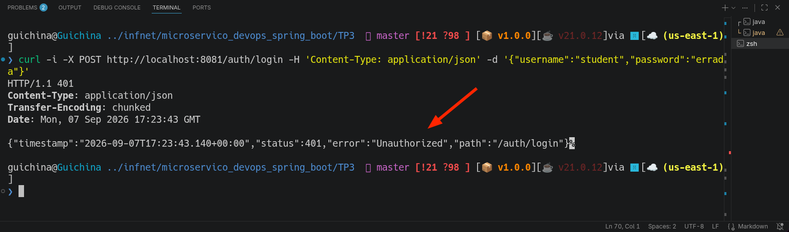

# TP3 — Autenticação com JWT

Sistema demonstrativo composto por dois serviços independentes, cada qual com seu próprio banco PostgreSQL. A autenticação é baseada em JWT com token de acesso e refresh token rotativo.

## Arquitetura

| Serviço | Porta | Responsabilidade | Dados |
|---|---:|---|---|
| `auth-service` | 8081 | Login, refresh e validação de credenciais JWT | Spring Data JDBC / `authdb` |
| `catalog-service` | 8082 | Catálogo com recursos protegidos | Spring WebFlux + Spring Data R2DBC / `catalogdb` |

O `catalog-service` usa `WebClient` de forma reativa para consultar o endpoint de validação do `auth-service` antes de liberar uma chamada protegida. Os serviços não compartilham banco de dados; compartilham apenas a chave JWT por configuração (`JWT_SECRET`).

## Pré-requisitos e execução

É necessário Java 21, Maven 3.9+ e Docker. Em um terminal, inicie os bancos:

```bash
docker compose up -d
mvn clean package
```

Em terminais separados, inicie os serviços:

```bash
mvn -pl auth-service spring-boot:run
mvn -pl catalog-service spring-boot:run
```

As configurações locais usam a chave de desenvolvimento já definida nos arquivos `application.yml`. Em ambiente real, defina a mesma variável `JWT_SECRET` nos dois serviços, com no mínimo 32 caracteres.

## Endpoints

Públicos:

- `POST /auth/login` — cria access token e refresh token.
- `POST /auth/refresh` — troca um refresh token válido por novo par de tokens.
- `GET /auth/validate` — valida internamente o JWT enviado no cabeçalho `Authorization`.
- `GET /actuator/health` — saúde de cada serviço.

Protegidos no catálogo:

- `GET /api/products`
- `GET /api/products/{id}`
- `POST /api/products`

O cabeçalho obrigatório é `Authorization: Bearer <access_token>`.

## Roteiro de demonstração

1. A rota protegida rejeita uma chamada sem credencial:

```bash
curl -i http://localhost:8082/api/products
```

O resultado é `401 Unauthorized`.

2. Autentique o usuário de demonstração (`student` / `spring123`):

```bash
curl -s -X POST http://localhost:8081/auth/login \
  -H 'Content-Type: application/json' \
  -d '{"username":"student","password":"spring123"}'
```

Guarde `accessToken` e `refreshToken` retornados. Credenciais inválidas retornam `401`:

```bash
curl -i -X POST http://localhost:8081/auth/login -H 'Content-Type: application/json' -d '{"username":"student","password":"errada"}'
```

3. Acesse o recurso autenticado:

```bash
curl http://localhost:8082/api/products -H "Authorization: Bearer $ACCESS_TOKEN"
```

4. Renove a sessão. O refresh token é de uso único; a resposta contém um novo access token e um novo refresh token:

```bash
curl -s -X POST http://localhost:8081/auth/refresh \
  -H 'Content-Type: application/json' \
  -d "{\"refreshToken\":\"$REFRESH_TOKEN\"}"
```

Repita a chamada ao catálogo com o novo `accessToken`.

## Testes

Os testes de integração inicializam PostgreSQL com Testcontainers. Eles cobrem a persistência JDBC do serviço de autenticação, a persistência R2DBC e o fluxo reativo HTTP do catálogo.

```bash
mvn test
```

O Docker deve estar disponível para a execução desses testes.

### Execução dos testes automatizados

A suíte de testes de integração foi executada com sucesso, validando a persistência JDBC, a persistência reativa com R2DBC e o bloqueio de rota protegida sem token.



## Evidências de execução

Os registros abaixo documentam o fluxo completo da aplicação em execução.

### Serviços iniciados

Os dois microsserviços foram iniciados nas portas configuradas: `auth-service` em `8081` e `catalog-service` em `8082`.



### Recurso protegido sem autenticação

A chamada ao catálogo sem o cabeçalho `Authorization` é rejeitada com `401 Unauthorized`.



### Autenticação e emissão de tokens

O login com as credenciais válidas retorna o access token JWT e o refresh token.



### Uso do token em rota protegida

Com o access token retornado pelo login, a consulta ao catálogo é processada normalmente.



### Renovação da credencial

O endpoint de refresh recebe o refresh token e retorna um novo access token e um novo refresh token.



### Acesso com o novo token

O novo access token obtido no refresh também é aceito pelo microsserviço de catálogo.



### Credenciais inválidas

Uma tentativa de login com senha incorreta recebe `401 Unauthorized`.


